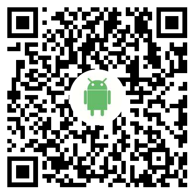
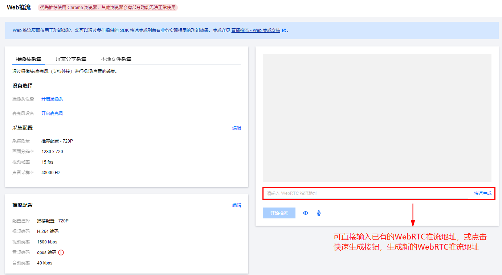
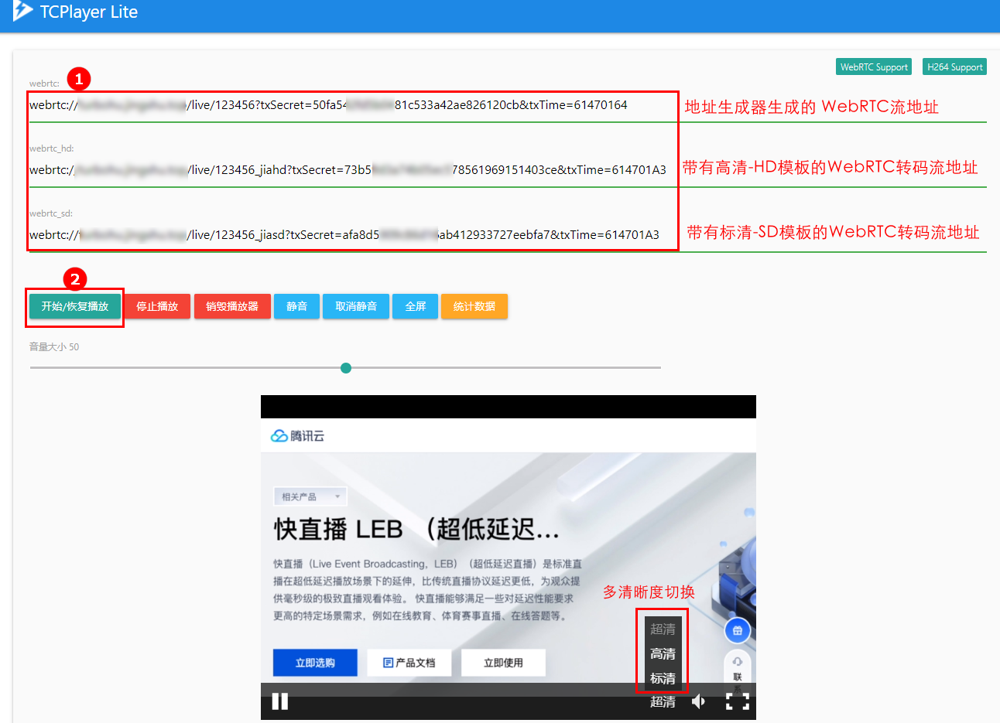

# DEMO体验

### Android&IOS demo 体验

视频云工具包是腾讯云开源的一套完整的音视频服务解决方案，您可通过视频云工具包体验快直播毫秒级低延迟拉流能力。

| 开发端  |                        体验安装                        |
| :-----: | :----------------------------------------------------: |
| Android |  |
|   iOS   |      |

|               推流演示（Android）                |               播放演示（Android）                |
| :----------------------------------------------: | :----------------------------------------------: |
|  |  |

### Web demo 体验

**Web 端直播推流**：可通过 **云直播控制台**>[Web 推流工具](https://console.cloud.tencent.com/live/tools/webpush) 进行测试 Web 端推流功能。

**Web 端直播拉流**：可通过 [WebRTC Live Demo](https://tcplayer.vcube.tencent.com/webrtc-demo/index.html) 工具进行播放体验。

**说明：**

- Web 端直播推流和拉流均使用标准 WebRTC 协议，Web 端推流时不包含 B帧 ，且音频编码为 OPUS 音频格式，所以不会产生音频转码及去 B 帧转码费用。
- WebRTC Live Demo 支持多清晰度功能，可在云直播控制台 **功能配置**>[**直播转码**](https://console.cloud.tencent.com/live/config/transcode) 配置高清-HD、标清-SD 的转码模板，将带有转码模板的 WebRTC 流地址填入 Demo 中对应的栏目后测试播放（如不需要测试此功能则只需要在 Demo 中填入一条 WebRTC 原始流即可）。
- 直播转码操作指引及转码计费内容，请参见文档 [直播转码](https://cloud.tencent.com/document/product/267/20385)。