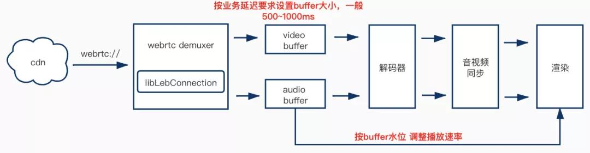
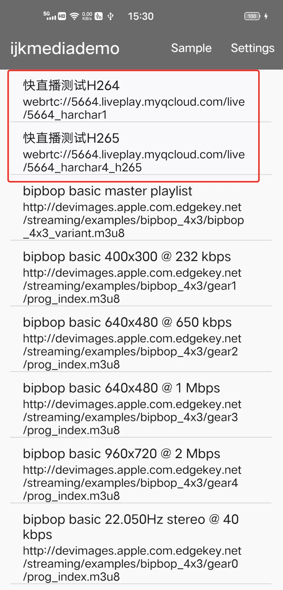
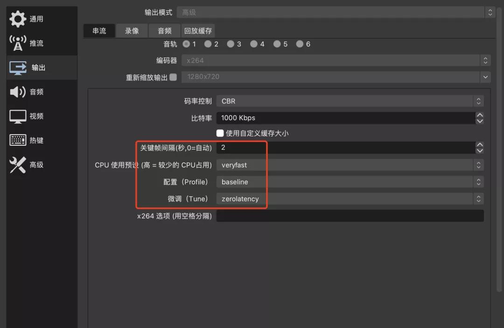
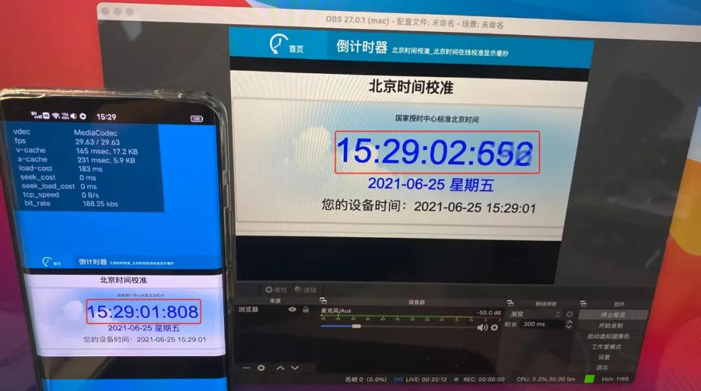

# **快直播传输层SDK播放器集成**Guide

 

### 1、 概述

 一般WebRTC SDK包含全套拉流、解码、渲染等功能，而在传统标准直播的客户中，往往已经有一套播放器和相应的业务逻辑，如何基于现有播放器快速接入快直播低延迟播放能力，成为普遍的客户需求。本示例基于使用广泛的具有代表性开源播放器ijkplayer，介绍接入快直播传输层SDK的方法及流程。

快直播传输层SDK输出是音视频裸数据，非常容易封装成demuxer集成到传统播放器中。

*我们提供适用于FFmpeg的webrtc demuxer源码用于集成，非FFmpeg的播放器可参考完成集成工作。

下图给出了ijkplayer集成快直播传输层SDK的工作流程，集成工作主要分为两步，第一步将libLebConnection封装实现webrtc_demuxer，第二步根据业务要求实现低延迟播控逻辑。下面以Android arm64为例，介绍具体集成工作。




### 2、 FFmpeg webrtc demuxer

FFmpeg webrtc demuxer只要按FFmpeg的AVInputFormat接口定义来实现ff_webrtc_demuxer，接口包括webrtc_probe，webrtc_read_header，webrtc_read_packet和webrtc_close。具体实现可以见SDK提供的**webrtc_demuxer.c** 源文件。

```c
AVInputFormat ff_webrtc_demuxer = {
    .name           = "webrtc",
    .long_name      = "webrtc demuxer",
    .priv_data_size = sizeof(WEBRTCContext),
    .read_probe     = webrtc_probe,
    .read_header    = webrtc_read_header,
    .read_packet    = webrtc_read_packet,
    .read_close     = webrtc_read_close,
    .extensions     = "webrtc",
    .priv_class     = &webrtc_class,
    .flags          = AVFMT_NOFILE,
};
```

 

### 3、具体集成方法

#### webrtc demuxer集成到ijkplayer有两种方式：外部注册demuxer和链接so方式引用demuxer

 

#### 3.1  第一种 外部注册demuxer

不改动FFmpeg，通过外部注册的方式集成。ijkplayer目前的FFmpeg是老版本的4.0，支持外部注册的方式注册第三方demuxer，我们可以不改动FFmpeg代码的情况下，使ijkplayer编译webrtc_demuxer.c源文件和链接libLebConnection库，在ff_ffplay.c使用快直播时注册ff_webrtc_demuxer。具体步骤如下：

 

1. 把头文件leb_conntion_api.h拷贝到ijkplayer/android/contrib/build/ffmpeg-arm64/output/include/下面，再把动态库文件libLebConnection_so.so拷贝到ijkplayer/android/contrib/build/ffmpeg-arm64/output/下面

 

2. 修改 ijkplayer/android/ijkplayer/ijkplayer-arm64/src/main/jni/ffmpeg/Android.mk（ijkplayer项目中，此文件软连接到ijkplayer/android/ijkplayer/ijkplayer-armv7a/src/main/jni/ffmpeg/Android.mk）

```diff
diff --git a/android/ijkplayer/ijkplayer-armv7a/src/main/jni/ffmpeg/Android.mk b/android/ijkplayer/ijkplayer-armv7a/src/main/jni/ffmpeg/Android.mk
index ec33908f..425ea292 100644
--- a/android/ijkplayer/ijkplayer-armv7a/src/main/jni/ffmpeg/Android.mk
+++ b/android/ijkplayer/ijkplayer-armv7a/src/main/jni/ffmpeg/Android.mk
@@ -3,4 +3,9 @@ LOCAL_PATH := $(call my-dir)
 include $(CLEAR_VARS)
 LOCAL_MODULE := ijkffmpeg
 LOCAL_SRC_FILES := $(MY_APP_FFMPEG_OUTPUT_PATH)/libijkffmpeg.so
-include $(PREBUILT_SHARED_LIBRARY)
\ No newline at end of file
+include $(PREBUILT_SHARED_LIBRARY)
+
+include $(CLEAR_VARS)
+LOCAL_MODULE := LebConnection_so
+LOCAL_SRC_FILES := $(MY_APP_FFMPEG_OUTPUT_PATH)/libLebConnection_so.so
+include $(PREBUILT_SHARED_LIBRARY)
```

 

3. 拷贝webrtc_demuxer.c放入到ijkplayer/ijkmedia/ijkplayer目录下
   
4. 修改ijkplayer/ijkmedia/ijkplayer/Android.mk文件，添加webrtc_demuxer.c编译和libLebConnection链接

```diff
diff --git a/ijkmedia/ijkplayer/Android.mk b/ijkmedia/ijkplayer/Android.mk
index 552c1142..cd614af1 100644
--- a/ijkmedia/ijkplayer/Android.mk
+++ b/ijkmedia/ijkplayer/Android.mk
@@ -77,7 +75,9 @@ LOCAL_SRC_FILES += ijkavutil/ijktree.c
 LOCAL_SRC_FILES += ijkavutil/ijkfifo.c
 LOCAL_SRC_FILES += ijkavutil/ijkstl.cpp
 
-LOCAL_SHARED_LIBRARIES := ijkffmpeg ijksdl
+LOCAL_SRC_FILES += webrtc_demuxer.c
+
+LOCAL_SHARED_LIBRARIES := ijkffmpeg ijksdl LebConnection_so
 LOCAL_STATIC_LIBRARIES := android-ndk-profiler ijksoundtouch
 
 LOCAL_MODULE := ijkplayer
```

 

5. 修改ijkplayer/android/ijkplayer/ijkplayer-arm64/src/main/jni/Application.mk，APP_STL改为c++_shared，这是由于libLebConnection 依赖了 libc++_shared 动态库。

```diff
diff --git a/android/ijkplayer/ijkplayer-arm64/src/main/jni/Application.mk b/android/ijkplayer/ijkplayer-arm64/src/main/jni/Application.mk
index 19189c34..d73685f9 100644
--- a/android/ijkplayer/ijkplayer-arm64/src/main/jni/Application.mk
+++ b/android/ijkplayer/ijkplayer-arm64/src/main/jni/Application.mk
@@ -23,7 +23,8 @@ APP_ABI := arm64-v8a
 NDK_TOOLCHAIN_VERSION=4.9
 APP_PIE := false
 
-APP_STL := stlport_static
+#APP_STL := stlport_static
+APP_STL := c++_shared
 
 APP_CFLAGS := -O3 -Wall -pipe \
     -ffast-math \
```

 

6. 修改ijkmedia/ijkplayer/ff_ffplay.c，添加播放快直播url打开逻辑，注册ff_webrtc_demuxer，并指定 ff_webrtc_demuxer 为 input format 。

```diff
diff --git a/ijkmedia/ijkplayer/ff_ffplay.c b/ijkmedia/ijkplayer/ff_ffplay.c
index 714a8c9d..c7368ff5 100755
--- a/ijkmedia/ijkplayer/ff_ffplay.c
+++ b/ijkmedia/ijkplayer/ff_ffplay.c
@@ -3114,11 +3188,15 @@ static int read_thread(void *arg)
         av_dict_set_int(&ffp->format_opts, "skip-calc-frame-rate", ffp->skip_calc_frame_rate, 0);
     }
 
-    if (ffp->iformat_name)
+    if (strncmp(is->filename, "webrtc://", 9) == 0) {
+        extern AVInputFormat ff_webrtc_demuxer;
+        av_register_input_format(&ff_webrtc_demuxer);
+        is->iformat = &ff_webrtc_demuxer;
+    } else if (ffp->iformat_name)
         is->iformat = av_find_input_format(ffp->iformat_name);

    av_dict_set_intptr(&ffp->format_opts, "video_cache_ptr", (intptr_t)&ffp->stat.video_cache, 0);
    av_dict_set_intptr(&ffp->format_opts, "audio_cache_ptr", (intptr_t)&ffp->stat.audio_cache, 0);
     err = avformat_open_input(&ic, is->filename, is->iformat, &ffp->format_opts);
     if (err < 0) {
         print_error(is->filename, err);

```


#### 3.2  第二种 链接so方式引用demuxer

新版本FFmpeg已经废弃外部注册demuxer，可以直接修改FFmpeg代码加入webrtc_demuxer到libavformat，编译webrtc_demuxer.c和链接libLebConnection_so.so

 

1. 直接将webrtc_demuxer.c拷贝到FFmpeg/libavformat文件夹下，并修改libavformat/Makefile，加入webrtc_demuxer.o编译。

```diff
--- a/libavformat/Makefile
+++ b/libavformat/Makefile
@@ -27,6 +27,7 @@ OBJS = allformats.o         \
        sdp.o                \
        seek.o               \
        url.o                \
        utils.o              \
+       webrtc_demuxer.o
```

 

2. 修改libavformat/allformats.c，加入ff_webrtc_demuxer

```diff
--- a/libavformat/allformats.c
+++ b/libavformat/allformats.c
@@ -489,6 +489,7 @@ extern AVInputFormat  ff_libgme_demuxer;
 extern AVInputFormat  ff_libmodplug_demuxer;
 extern AVInputFormat  ff_libopenmpt_demuxer;
 extern AVInputFormat  ff_vapoursynth_demuxer;
+extern AVInputFormat  ff_webrtc_demuxer;
```

 

3. 此时FFmpeg configure需要加入libLebConnection头文件和库的依赖的选项:

```
--extra-cflags=-I/path/libLebConnection/include --extra-ldflags=-L/path/libLebConnection/lib/ --extra-libs='-lLebConnection_so -lc++_shared
```

 

4. 修改ijkmedia/ijkplayer/ff_ffplay.c，添加播放快直播url逻辑，注册ff_webrtc_demuxer并指定为 input format 。同第一种方法的第5和6步。

 

### 4、低延迟播控优化

在完成上面集成工作后，ijkplayer就能播放webrtc://开头的快直播url。在ijkplayer demo播放list中添加快直播url，如下图所示:

 


#### 4.1 低延迟播控优化

由于FFmpeg和ijkplayer有较大buffer缓冲，端到端的延迟依旧比较大，需要针对低延迟进行播控优化，优化分为两部分

 

##### •  第一部分优化，修改ijkplayer配置，使其适合低延迟播放场景。

1. 直播场景时实时推流，可以开启无限制buffer，这样可以尽可能快的读取数据，避免出现网络拥塞恢复后延迟累积的情况。

   

2. ijkplayer中的buffering逻辑不适合低延迟直播场景，可以关闭。快直播传输层SDK是基于webrtc增强的半可靠传输协议，在一般弱网（20%）下能保证音视频正常播放，极端弱网（50%丢包）场景下，也可以保证音频正常播放，视频低帧率播放。

   ```diff
   diff --git a/ijkmedia/ijkplayer/ff_ffplay.c b/ijkmedia/ijkplayer/ff_ffplay.c
   index 714a8c9d..c7368ff5 100755
   --- a/ijkmedia/ijkplayer/ff_ffplay.c
   +++ b/ijkmedia/ijkplayer/ff_ffplay.c
   @@ -3114,11 +3188,15 @@ static int read_thread(void *arg)
            av_dict_set_int(&ffp->format_opts, "skip-calc-frame-rate", ffp->skip_calc_frame_rate, 0);
        }
    
       if (strncmp(is->filename, "webrtc://", 9) == 0) {
           extern AVInputFormat ff_webrtc_demuxer;
           av_register_input_format(&ff_webrtc_demuxer);
           is->iformat = &ff_webrtc_demuxer;
   +        ffp->low_delay_playback = 1; //打开低延迟开关控制
   +        ffp->infinite_buffer = 1; //开启无限制buffer
   +        ffp->packet_buffering = 0; //关闭buffering
        } else if (ffp->iformat_name)
            is->iformat = av_find_input_format(ffp->iformat_name);
   
       av_dict_set_intptr(&ffp->format_opts, "video_cache_ptr", (intptr_t)&ffp->stat.video_cache, 0);
       av_dict_set_intptr(&ffp->format_opts, "audio_cache_ptr", (intptr_t)&ffp->stat.audio_cache, 0);
        err = avformat_open_input(&ic, is->filename, is->iformat, &ffp->format_opts);
        if (err < 0) {
            print_error(is->filename, err);
   
    
   ```

3. 需要根据buffer水位调整播放速率，同时开启soundtouch对倍速播放下对PCM进行处理，实现变速不变调。

   ```diff
   diff --git a/android/ijkplayer/ijkplayer-example/src/main/java/tv/danmaku/ijk/media/example/widget/media/IjkVideoView.java b/android/ijkplayer/ijkplayer-example/src/main/java/tv/danmaku/ijk/media/example/widget/media/IjkVideoView.java
   index d4200045..48281972 100755
   --- a/android/ijkplayer/ijkplayer-example/src/main/java/tv/danmaku/ijk/media/example/widget/media/IjkVideoView.java
   +++ b/android/ijkplayer/ijkplayer-example/src/main/java/tv/danmaku/ijk/media/example/widget/media/IjkVideoView.java
   @@ -1082,6 +1076,14 @@ public class IjkVideoView extends FrameLayout implements MediaController.MediaPl
                        ijkMediaPlayer.setOption(IjkMediaPlayer.OPT_CATEGORY_FORMAT, "http-detect-range-support", 0);
    
                        ijkMediaPlayer.setOption(IjkMediaPlayer.OPT_CATEGORY_CODEC, "skip_loop_filter", 48);
   +
   +ijkMediaPlayer.setOption(IjkMediaPlayer.OPT_CATEGORY_PLAYER,"soundtouch", 1);
                    }
                    mediaPlayer = ijkMediaPlayer;
                }
   ```

   


##### •  第二部分优化，需要实现根据buffer水位调整播放速率。

下面代码是一个简单的示例，原理就是

1. 当buffer时长大于目标高水位时加快播放速率进行追帧

2. 当buffer时长小于目标低水位时降低播放速率等待新数据

3. 当buffer时长在高低水位区间之内保持正常播放速率

 示例中目标高水位为500ms，目标低水位为200ms，实际可以根据业务的延迟要求设置具体阈值

```diff
diff --git a/ijkmedia/ijkplayer/ff_ffplay_def.h b/ijkmedia/ijkplayer/ff_ffplay_def.h
index 00f19f3c..f38a790c 100755
--- a/ijkmedia/ijkplayer/ff_ffplay_def.h
+++ b/ijkmedia/ijkplayer/ff_ffplay_def.h
@@ -720,6 +728,14 @@ typedef struct FFPlayer {
     char *mediacodec_default_name;
     int ijkmeta_delay_init;
     int render_wait_start;
+
+    int low_delay_playback;
+    int high_level_ms;
+    int low_level_ms;
+
+    int64_t update_plabyback_rate_time;
+    int64_t update_plabyback_rate_time_prev;
 } FFPlayer;
 
 #define fftime_to_milliseconds(ts) (av_rescale(ts, 1000, AV_TIME_BASE))
@@ -844,6 +860,15 @@ inline static void ffp_reset_internal(FFPlayer *ffp)
     ffp->pf_playback_volume             = 1.0f;
     ffp->pf_playback_volume_changed     = 0;
 
+    ffp->low_delay_playback             = 0;
+
+    ffp->high_level_ms                  = 500;
+    ffp->low_level_ms                   = 200;
+
+    ffp->update_plabyback_rate_time      = 0;
+    ffp->update_plabyback_rate_time_prev = 0;
+
     av_application_closep(&ffp->app_ctx);
     ijkio_manager_destroyp(&ffp->ijkio_manager_ctx);
```


```diff
diff --git a/ijkmedia/ijkplayer/ff_ffplay.c b/ijkmedia/ijkplayer/ff_ffplay.c
index 714a8c9d..c7368ff5 100755
--- a/ijkmedia/ijkplayer/ff_ffplay.c
+++ b/ijkmedia/ijkplayer/ff_ffplay.c
@@ -2448,6 +2467,60 @@ static int synchronize_audio(VideoState *is, int nb_samples)
     return wanted_nb_samples;
 }
 
+
+static void update_playback_rate_by_audio(FFPlayer *ffp)
+{
+    VideoState *is = ffp->is;
+    int cached_duration_in_ms = -1;
+    int64_t audio_cached_duration = -1;
+    int audio_time_base_valid = 0;
+    float target_playback_rate = 1.0;
+
+    if(is->audio_st)
+        audio_time_base_valid = is->audio_st->time_base.den > 0 && is->audio_st->time_base.num > 0;
+
+    if (is->audio_st && audio_time_base_valid) {
+        audio_cached_duration = ffp->stat.audio_cache.duration;
+    }
+
+    if (audio_cached_duration > 0) {
+        cached_duration_in_ms = (int)audio_cached_duration;
+    }
+
+    av_log(ffp, AV_LOG_INFO, "audio cached_duration_in_ms: %d\n", cached_duration_in_ms);
+    if (cached_duration_in_ms > ffp->high_level_ms) {
+        float exceed_rate = 1.0 * cached_duration_in_ms / ffp->high_level_ms;
+        // map to play rate
+        if (exceed_rate > 1.5) {
+            target_playback_rate = 1.5;
+        } else if (exceed_rate <= 1.5 && exceed_rate > 1.4) {
+            target_playback_rate = 1.4;
+        } else if (exceed_rate <= 1.4 && exceed_rate > 1.3) {
+            target_playback_rate = 1.3;
+        } else if (exceed_rate <= 1.3 && exceed_rate > 1.2) {
+            target_playback_rate = 1.2;
+        } else if (exceed_rate <= 1.2 && exceed_rate > 1.1) {
+            target_playback_rate = 1.1;
+        } else {
+            target_playback_rate = 1.0;
+        }
+    } else if (cached_duration_in_ms <= ffp->high_level_ms && cached_duration_in_ms > ffp->low_level_ms) {
+        target_playback_rate = 1.0;
+    } else if (cached_duration_in_ms <= ffp->low_level_ms) {
+        float exceed_rate = 1.0 * cached_duration_in_ms / ffp->low_level_ms;
+        // map to play rate
+        if (exceed_rate <= 1.0 && exceed_rate > 0.9) {
+            target_playback_rate = 0.9;
+        } else if (exceed_rate <= 0.9) {
+            target_playback_rate = 0.8;
+        }
+    }
+#define MAX_PLAYBACK_CHNAGING_STEP  0.2
+    target_playback_rate = FFMAX(target_playback_rate, ffp->pf_playback_rate - MAX_PLAYBACK_CHNAGING_STEP);
+    target_playback_rate = FFMIN(target_playback_rate, ffp->pf_playback_rate + MAX_PLAYBACK_CHNAGING_STEP);
+    ffp_set_playback_rate(ffp, target_playback_rate);
+}
+
 /**
  * Decode one audio frame and return its uncompressed size.
  *
@@ -4641,6 +4719,68 @@ void ffp_statistic_l(FFPlayer *ffp)
 {
     ffp_audio_statistic_l(ffp);
     ffp_video_statistic_l(ffp);
+
+    if (ffp->low_delay_playback) {
+        ffp->update_plabyback_rate_time = SDL_GetTickHR();
+        if (ffp->update_plabyback_rate_time - ffp->update_plabyback_rate_time_prev > 50) {
+            update_playback_rate_by_audio(ffp);
+            ffp->update_plabyback_rate_time_prev = ffp->update_plabyback_rate_time;
+        }
+    }
 }
```


#### 4.2、低延迟优化效果验证——端到端延迟测试

​	1.先通过OBS推流时间秒表页面，并进行低延迟编码设置：GOP设2秒，编码模式veryfast，Profile为baseline，并采用zerolatency降低编码延时



​	

​	2.ijkplayer目标buffer水位设置200~300ms，可以稳定流畅播放快直播流，对两端画面的比秒表时间间隔，端到端延迟稳定在800ms左右。当然我们的低延时播控优化示例只是抛砖引玉，客户可能需要在各自的业务场景下进行具体的优化适配。




