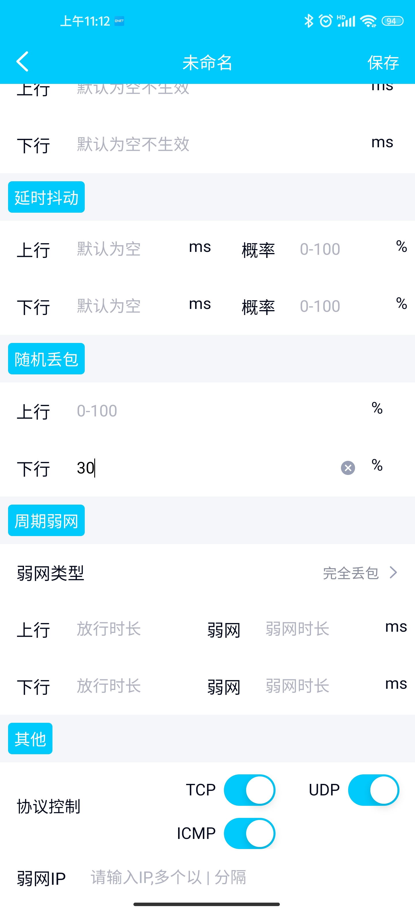
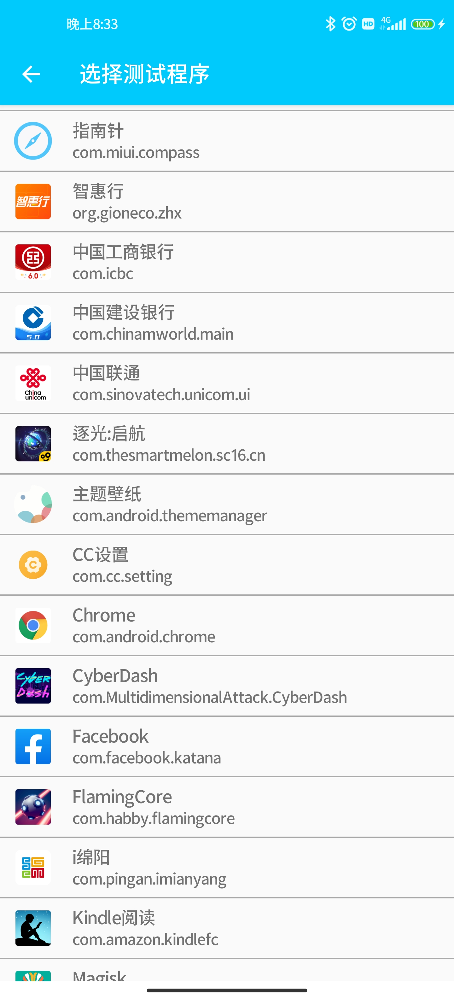

# 快直播传输层SDK播放器集成Tips

 

### 1、 卡顿统计功能 

由于关闭了buffering，现可以通过统计渲染刷新时间间隔来统计卡顿参数。当视频渲染时间间隔大于一定阈值，记一次卡顿次数，并累计进卡顿时长。

下边还是以ijkplayer为例，演示卡顿统计的开发。

#### 1.1 代码修改

1）在VideoState、FFPlayer结构体中添加卡顿统计需要用到的变量

```diff
diff --git a/ijkmedia/ijkplayer/ff_ffplay_def.h b/ijkmedia/ijkplayer/ff_ffplay_def.h
index 00f19f3c..f38a790c 100755
--- a/ijkmedia/ijkplayer/ff_ffplay_def.h
+++ b/ijkmedia/ijkplayer/ff_ffplay_def.h
@@ -418,6 +418,14 @@ typedef struct VideoState {
     SDL_cond  *audio_accurate_seek_cond;
     volatile int initialized_decoder;
     int seek_buffering;
+
+    int64_t stream_open_time;
+    int64_t first_frame_display_time;
+    int64_t last_display_time;
+    int64_t current_display_time;
+    int64_t frozen_time;
+    int frozen_count;
+    float frozen_rate;
 } VideoState;
 
 /* options specified by the user */
@@ -720,6 +728,14 @@ typedef struct FFPlayer {
     char *mediacodec_default_name;
     int ijkmeta_delay_init;
     int render_wait_start;

     int low_delay_playback;
+    int frozen_interval;
     int high_level_ms;
     int low_level_ms;

     int64_t update_plabyback_rate_time;
     int64_t update_plabyback_rate_time_prev;
 } FFPlayer;
 
 #define fftime_to_milliseconds(ts) (av_rescale(ts, 1000, AV_TIME_BASE))
@@ -844,6 +860,15 @@ inline static void ffp_reset_internal(FFPlayer *ffp)
     ffp->pf_playback_volume             = 1.0f;
     ffp->pf_playback_volume_changed     = 0;
 
     ffp->low_delay_playback             = 0;
 
     ffp->high_level_ms                  = 500;
     ffp->low_level_ms                   = 200;
+    ffp->frozen_interval                = 200;
 
     ffp->update_plabyback_rate_time      = 0;
     ffp->update_plabyback_rate_time_prev = 0;

     av_application_closep(&ffp->app_ctx);
     ijkio_manager_destroyp(&ffp->ijkio_manager_ctx);
```

2）添加卡顿统计逻辑

```diff
diff --git a/ijkmedia/ijkplayer/ff_ffplay.c b/ijkmedia/ijkplayer/ff_ffplay.c
index 714a8c9d..c7368ff5 100755
--- a/ijkmedia/ijkplayer/ff_ffplay.c
+++ b/ijkmedia/ijkplayer/ff_ffplay.c
@@ -874,6 +874,25 @@ static void video_image_display2(FFPlayer *ffp)
     VideoState *is = ffp->is;
     Frame *vp;
     Frame *sp = NULL;
+    int64_t display_interval = 0;
+
+    if (!is->first_frame_display_time){
+        is->first_frame_display_time = SDL_GetTickHR() - is->stream_open_time;
+    }
+    
+    is->last_display_time = is->current_display_time;
+    is->current_display_time = SDL_GetTickHR() - is->stream_open_time;
+    display_interval = is->current_display_time - is->last_display_time;
+    av_log(NULL, AV_LOG_DEBUG, "last_display_time:%"PRId64" current_display_time:%"PRId64" display_interval:%"PRId64"\n", is->last_display_time, is->current_display_time, display_interval);
+
+    if (is->last_display_time > 0) {
+        if (display_interval > ffp->frozen_interval) {
+            is->frozen_count += 1;
+            is->frozen_time += display_interval;
+        }
+    }
+    is->frozen_rate = (float) is->frozen_time / is->current_display_time;
+    av_log(NULL, AV_LOG_DEBUG, "frozen_interval:%d frozen_count:%d frozen_time:%"PRId64" is->current_display_time:%"PRId64" frozen_rate: %f ", ffp->frozen_interval, is->frozen_count, is->frozen_time, is->current_display_time, is->frozen_rate);
 
     vp = frame_queue_peek_last(&is->pictq);
 
```

Notes: 本示例中卡顿阈值frozen_interval初始化值为200(ms)，可根据业务需要进行调整


####  1.3、卡顿参数统计测试——使用QNET模拟弱网环境进行测试

​	1.下载QNET网络测试工具

​	下载地址：https://wetest.qq.com/product/qnet/

​	2.打开QNET，点击[新增]-[模版类型]-[自定义模版]，根据需要配置弱网模版和参数(下图配置为下行网络30%随机丢包)



​	3.选择测试程序



​	4.开启弱网进行测试

*为便于测试，下图中显示的卡顿参数是根据上述卡顿参数统计的修改，通过jni将数据传递到java层进行显示的，客户可根据自己的需求定制卡顿统计测试策略


### 2、 soundtouch优化

根据buffer水位调整播放速率的修改，会用到soundtouch进行音频变速实现。但在网络波动较大、buffer水位调整频率高需要多次变速处理时，原生ijkplayer对于soundtouch的调用可能出现噪音问题，可参考如下代码进行优化。

修改：在调用soundtouch进行变速处理时，如果是低延时播放模式，则全部buffer都是用soundtouch进行translate

```diff
diff --git a/ijkmedia/ijkplayer/ff_ffplay.c b/ijkmedia/ijkplayer/ff_ffplay.c
index 714a8c9d..c7368ff5 100755
--- a/ijkmedia/ijkplayer/ff_ffplay.c
+++ b/ijkmedia/ijkplayer/ff_ffplay.c
@@ -2579,7 +2652,7 @@ reload:
         int bytes_per_sample = av_get_bytes_per_sample(is->audio_tgt.fmt);
         resampled_data_size = len2 * is->audio_tgt.channels * bytes_per_sample;
 #if defined(__ANDROID__)
-        if (ffp->soundtouch_enable && ffp->pf_playback_rate != 1.0f && !is->abort_request) {
+        if (ffp->soundtouch_enable && (ffp->pf_playback_rate != 1.0f || ffp->low_delay_playback) && !is->abort_request) {
             av_fast_malloc(&is->audio_new_buf, &is->audio_new_buf_size, out_size * translate_time);
             for (int i = 0; i < (resampled_data_size / 2); i++)
             {

```


### 3、 打开MediaCodec后，h265不使用MediaCodec解码问题

快直播传输层的特色是支持h265格式的视频流，但是原生ijkplayer在Settings中勾选打开`Using MediaCodec`后，h265的视频流不会使用MediaCodec进行解码。可参考如下代码进行优化：

```diff
diff --git a/ijkmedia/ijkplayer/ff_ffplay_options.h b/ijkmedia/ijkplayer/ff_ffplay_options.h
index b021c26e..958b3bae 100644
--- a/ijkmedia/ijkplayer/ff_ffplay_options.h
+++ b/ijkmedia/ijkplayer/ff_ffplay_options.h
@@ -178,8 +178,8 @@ static const AVOption ffp_context_options[] = {
         OPTION_OFFSET(vtb_handle_resolution_change),    OPTION_INT(0, 0, 1) },
 
     // Android only options
-    { "mediacodec",                             "MediaCodec: enable H264 (deprecated by 'mediacodec-avc')",
-        OPTION_OFFSET(mediacodec_avc),          OPTION_INT(0, 0, 1) },
+    { "mediacodec",                             "MediaCodec: enable all_videos (deprecated by 'mediacodec_all_videos')",
+        OPTION_OFFSET(mediacodec_all_videos),   OPTION_INT(0, 0, 1) },
     { "mediacodec-auto-rotate",                 "MediaCodec: auto rotate frame depending on meta",
         OPTION_OFFSET(mediacodec_auto_rotate),  OPTION_INT(0, 0, 1) },
     { "mediacodec-all-videos",                  "MediaCodec: enable all videos",
```

