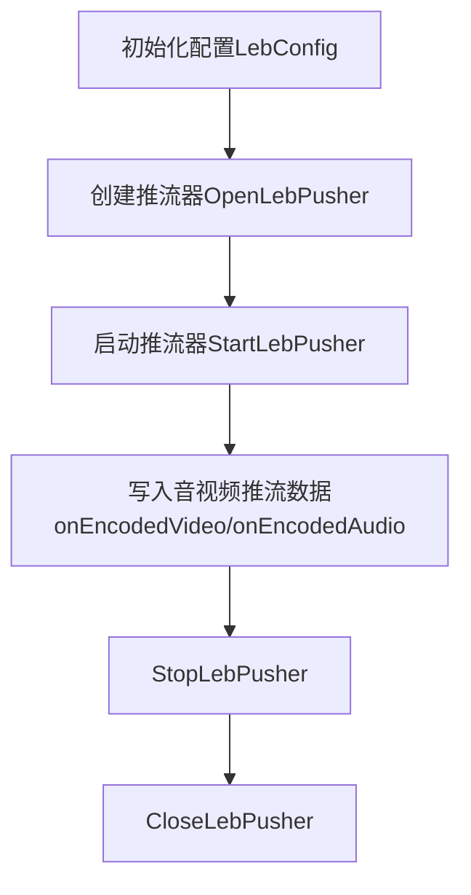

## WebRTC的快直播推流

### 0> 接入详细文档(对外同步更新最新的sdk接入文档)
   https://docs.qq.com/doc/DVU5XY21WRnpvRUZO

### 1> 主要功能
    支持音视频推流，支持单独音频推流，视频推流，支持h264，h265，aac，opus等编码，支持aac/latm格式

### 2> 推流模块框架

### 3> 接口API
#### 3.1> 初始化配置，创建推流器
        typedef struct LebConfig {
          int is_whip;
          // 码流地址，如:
          // "webrtc://webrtcpush.myqcloud.com/live/5664_harchar1"，给内部udp信令用
          const char* stream_url;
          // 信令ip或域名，默认为"webrtcpush.myqcloud.com"
          const char* signal_address;
          // 视频开关
          int enable_video;
          // 音频开关
          int enable_audio;
          // 统计回调周期，内部默认1秒, 0~5s
          float stats_period_ms;、
          //调度线程最大任务数200
          uint32_t max_tasks_per_thread;
            //to-do
            //由上层用户设置,当出现崩溃时，下次启动时设置进去
            //  [
            //   {
            //     "time:":"2023-03-23 20:43:52",
            //     "sdkver":"1.0.1",
            //     "os":"15.5",
            //     "device" :"linux",
            //     "abi" : "x64",
            //     "stack" "崩溃堆栈",
            //   },
            //   {
            //     "time:":"2023-03-23 20:43:52",
            //     "sdkver":"1.0.1",
            //     "os":"15.5",
            //     "device" :"ios",
            //     "abi" : "arm64",
            //     "stack" "崩溃堆栈",
            //   }
            //   ]
          const char* last_bug_json;
          //to-do 
          const char* report_api;
          //TO-DO
        } LebConfig;
        //初始化配置
        LebConfig config;
        config.stream_url = pushurl;
        config.signal_address = "webrtcpush.myqcloud.com";//"webrtcpush.myqcloud.com"
        config.enable_video = 1;
        config.enable_audio = 1;
        config.stats_period_ms = 0.f;
        config.max_tasks_per_thread = 200;
        config.last_bug_json = NULL;
        config.report_api = NULL;
        //创建推流器
        handle_ = OpenLebPusher(this, kInfo);
        //注册回调函数
        a>状态回调
        handle_->onConnectionChange = OnConnectionChangeCallback;
        b> 错误回调
        handle_->onError = OnErrorCallbck;
        c> 日志回调
        handle_->onLogInfo = OnLogCallback;
        d>统计回调
        handle_->onStatsInfo = OnStatsCallback;
        //设置推流音视频原数据
        handle_->callback.onVideoInfo(handle_, video_info_);
        handle_->callback.onAudioInfo(handle_, audio_info_);
##### 3.2>启动推流器
        StartLebPusher(handle_, config);
        typedef struct LebCallback {
        //  // 日志回调
        //  OnLogInfo onLogInfo;
           
          
          // 视频信息设置
          OnVideoInfo onVideoInfo;
          // 音频信息设置
          OnAudioInfo onAudioInfo;
          // 视频数据
          OnEncodedVideo onEncodedVideo;
          // 音频数据
          OnEncodedAudio onEncodedAudio;
          // MetaData设置
          OnMetaData onMetaData;
          
          
        //  // 统计信息设置
        //  OnStatsInfo onStatsInfo;
        //  // 错误回调
        //  OnError onError;
        //  // 连接状态回调
        //  OnConnectionChange onConnectionChange;
          
          //运行时控制
          OnCtxControl onCtxControl;
        } LebCallback;

#### 3.3> 写入音视频推流数据
        LebEncodedVideoFrame videoframe;
        handle_->callback.onEncodedVideo(handle_, videoframe);

        LebEncodedAudioFrame audioframe; 
        handle_->callback.onEncodedAudio(handle_, audioframe);

#### 3.4> 停止和关闭推流器
        StopLebPusher(handle_);
            
        CloseLebPusher(handle_);

### 4> 推流sdk 流程图

### 5> 功能集成
#### 5.1> 通过sdk api集成 参考sdk的leb_push_api.h头文件
        参考上面的接口说明，或者sdk中提供的demo代码

### 6>SDK
#### 6.1> linux版本sdk:
    最新版本下载路径：
    https://media-frame-1258344699.cos.ap-nanjing.myqcloud.com/tstan/xp2p/leb_push_sdk_linux_release_v_1.1.2_786f47b510_md3ba9c065da_2023_09_21_16_33.zip

    sdk内容说明：
    leb_push_sdk  
    ├── leb_push_api.h
    └── libLebPusher_so.so

    已经集成了推流webrtc功能的ffmpeg。
    sdk_demo/
    └── ffmpeg_g

#### 6.2> macos版本sdk
如有需要，请联系开发人员
    TO-DO

#### 6.3> window版本sdk
如有需要，请联系开发人员
    TO-DO
#### 6.3> 移动端版本版本sdk
如有需要，请联系开发人员
    TO-DO

